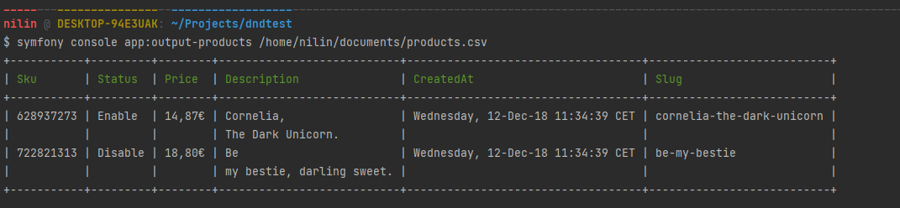
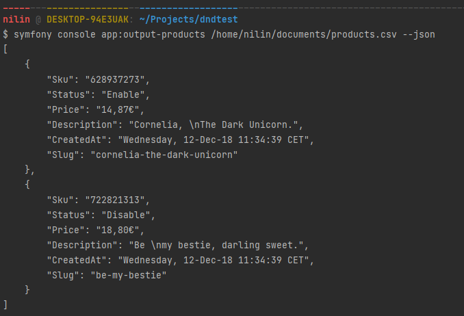

# Librairie PHP d'une commande Symfony

La commande symfony prend en entrée un fichier plat de type CSV et affiche les données sous forme de tableau.

## Stack technique
* PHP 8.2
* Symfony 6.2
* PHPUnit 10.0

## Installer le projet
```
$ git clone https://github.com/NilinC/dndtest
$ cd dndtest/
$ composer install

// Pour lancer la commande
$ php bin/console app:output-products <lien_fichier.csv>

// Pour obtenir le rendu sous format JSON
$ php bin/console app:output-products <lien_fichier.csv> --json

// Pour lancer les tests unitaires
$ php bin/phpunit
```

Voici les exemples de rendu selon les options passées ou non à la commande

**Sans option**



**Avec option JSON**


